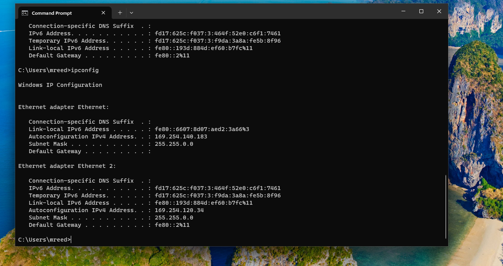
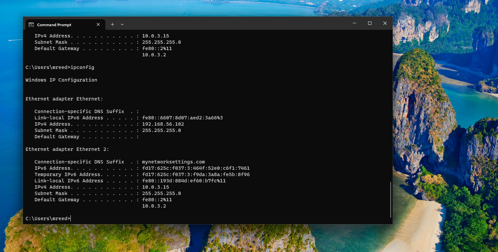
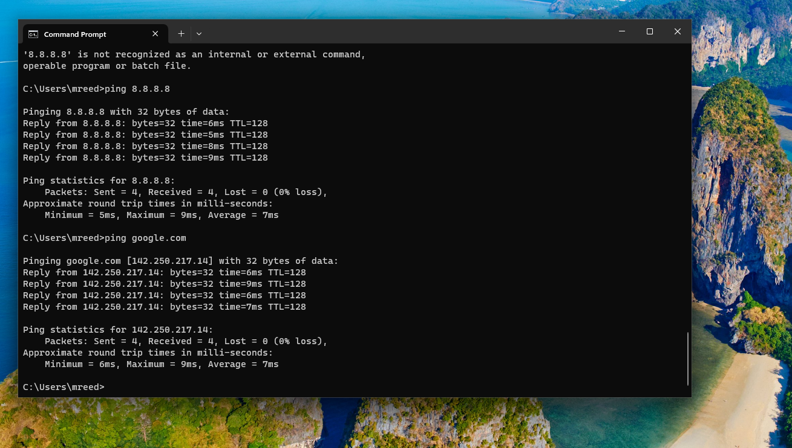
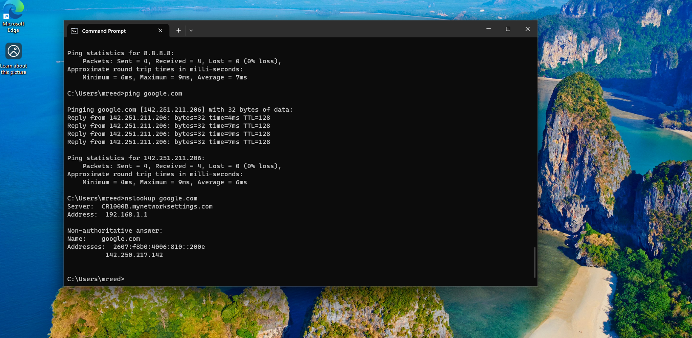
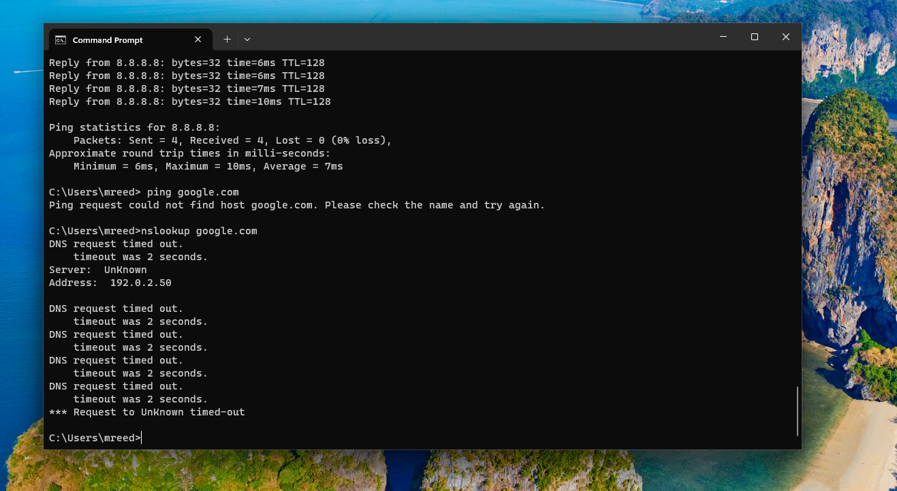
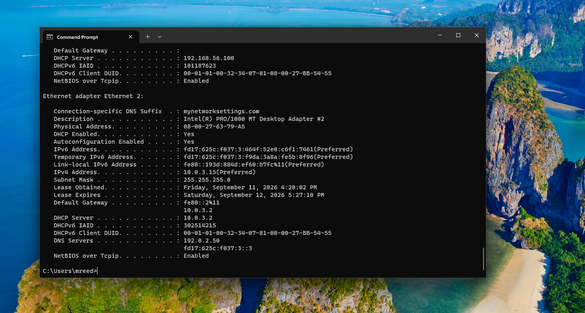
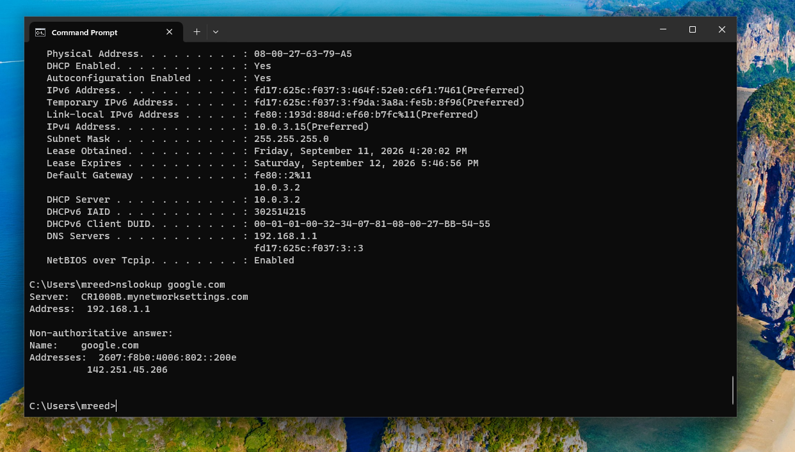
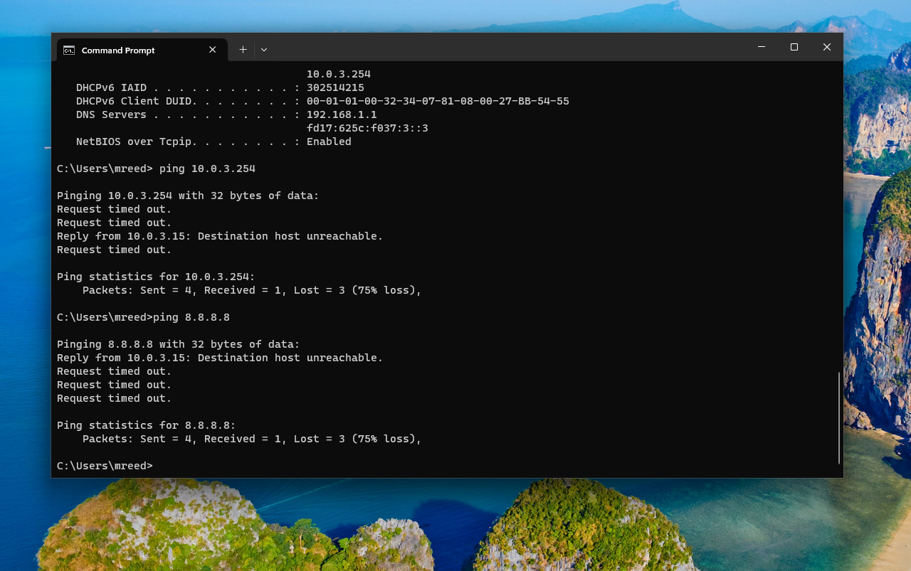
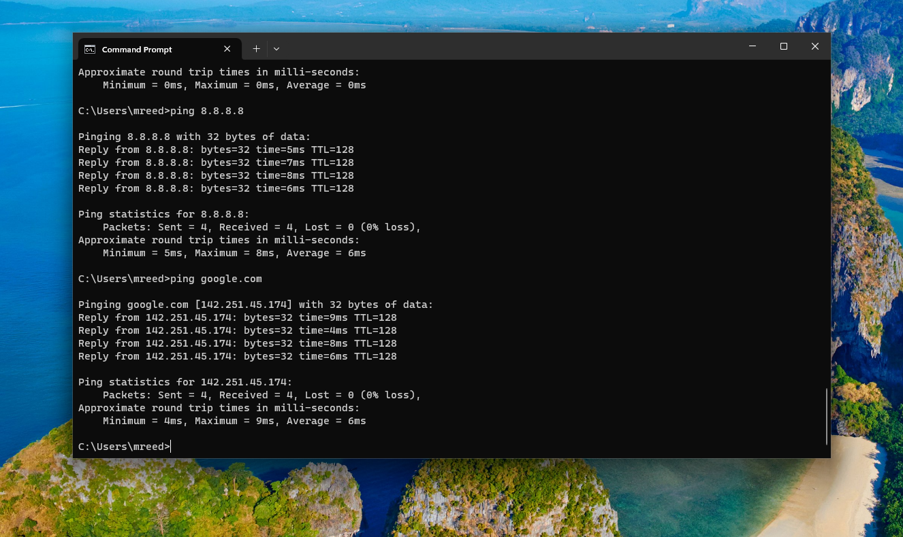
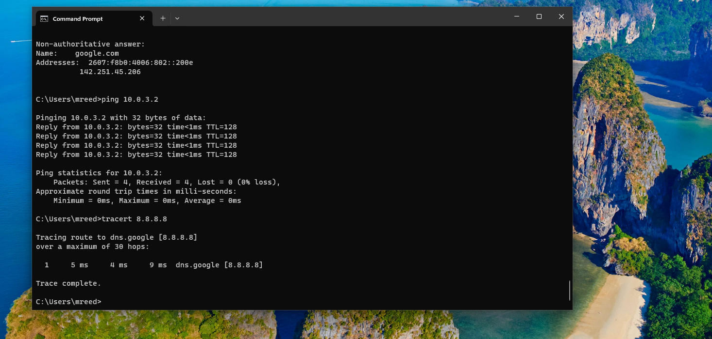

# Lab 03 - Windows Network Troubleshooting

## Objective

The goal of this lab was to practice Tier 1 Windows network troubleshooting using a Windows 11 VirtualBox workstation.

This lab focused on identifying and resolving problems involving:

- IPv4 configuration
- DHCP
- DNS
- Default gateway connectivity
- External network connectivity
- Name resolution
- Basic route testing

## Environment

- Windows 11 virtual machine
- VirtualBox
- Standard user account: `mreed`
- Internet-facing adapter: `Ethernet 2`
- VirtualBox NAT networking

## Commands Used

```cmd
ipconfig
ipconfig /all
ipconfig /release
ipconfig /renew
ping 10.0.3.2
ping 8.8.8.8
ping google.com
nslookup google.com
tracert 8.8.8.8
ncpa.cpl
```

## DHCP Troubleshooting

I first reviewed the workstation's working network configuration.

The workstation normally received its IPv4 settings automatically using DHCP.

I then used:

```cmd
ipconfig /release
```

After releasing the address, Windows assigned an APIPA address beginning with `169.254`.

This indicated that the workstation did not currently have a usable DHCP-assigned IPv4 configuration.

I restored the network configuration with:

```cmd
ipconfig /renew
```

The workstation received its normal IPv4 address, subnet mask, and default gateway again.

### Evidence







## DNS Troubleshooting

I intentionally configured an invalid DNS server on the workstation to simulate a realistic DNS issue.

The workstation could still communicate with an external IP address:

```cmd
ping 8.8.8.8
```

However, hostname-based connectivity failed:

```cmd
ping google.com
```

I then used:

```cmd
nslookup google.com
```

The DNS request timed out.

Using:

```cmd
ipconfig /all
```

I identified the incorrect DNS server configuration.

I restored the adapter to:

`Obtain DNS server address automatically`

After restoring the correct configuration, `nslookup google.com` successfully resolved the hostname and websites loaded normally.

### Evidence









## Default Gateway Troubleshooting

I also simulated a workstation with an incorrect manually configured default gateway.

The workstation was configured with:

```text
IPv4 Address:     10.0.3.15
Subnet Mask:      255.255.255.0
Default Gateway:  10.0.3.254
```

The normal working default gateway was:

```text
10.0.3.2
```

I used:

```cmd
ping 10.0.3.254
```

to directly test the configured gateway.

The test failed.

I then tested external connectivity with:

```cmd
ping 8.8.8.8
```

That test also failed.

Using `ipconfig /all`, I discovered that DHCP was disabled and the adapter was using manually configured IPv4 settings.

I restored:

`Obtain an IP address automatically`

and:

`Obtain DNS server address automatically`

After DHCP restored the proper configuration, the workstation received the correct default gateway of `10.0.3.2`.

I verified the repair by successfully testing:

```cmd
ping 10.0.3.2
ping 8.8.8.8
ping google.com
```

The user was also able to load websites successfully in Microsoft Edge.

### Evidence





## Traceroute Testing

I used:

```cmd
tracert 8.8.8.8
```

to examine the route traffic took toward an external destination.

Because the workstation was running behind VirtualBox NAT, the route appeared shorter than it might on a physical enterprise network.

### Evidence



## Key Concepts Learned

### DHCP

DHCP automatically provides network configuration such as:

- IP address
- Subnet mask
- Default gateway
- DNS information

An APIPA address beginning with `169.254` can indicate that a workstation failed to obtain usable IPv4 configuration from DHCP.

### DNS

DNS translates hostnames such as `google.com` into IP addresses.

A workstation may still have connectivity by IP while hostname-based access fails if DNS is not working.

### Default Gateway

The default gateway is the path a workstation uses to reach destinations outside its local network.

A configured gateway should not automatically be assumed to be working. It should be tested directly when troubleshooting connectivity.

### Ping

`ping` is used to test whether a destination can be reached.

### NSLookup

`nslookup` is used to test DNS name resolution.

### Tracert

`tracert` shows the path or hops traffic takes toward a destination.

## Troubleshooting Method

Throughout the lab I followed a structured troubleshooting process:

1. Gather information from the user
2. Determine whether the issue is isolated or widespread
3. Inspect the workstation's configuration
4. Form a hypothesis
5. Test the suspected cause
6. Identify the root cause
7. Apply the appropriate fix
8. Verify technical connectivity
9. Verify that the user's original problem is resolved
10. Document the incident

## Skills Practiced

- Windows network troubleshooting
- IPv4 troubleshooting
- DHCP troubleshooting
- DNS troubleshooting
- Default gateway troubleshooting
- Command Prompt networking tools
- Network adapter configuration
- Root cause identification
- User verification
- Help Desk ticket methodology
