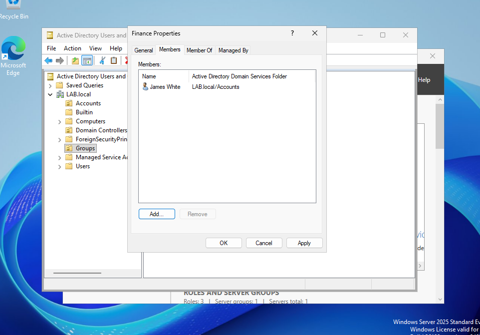
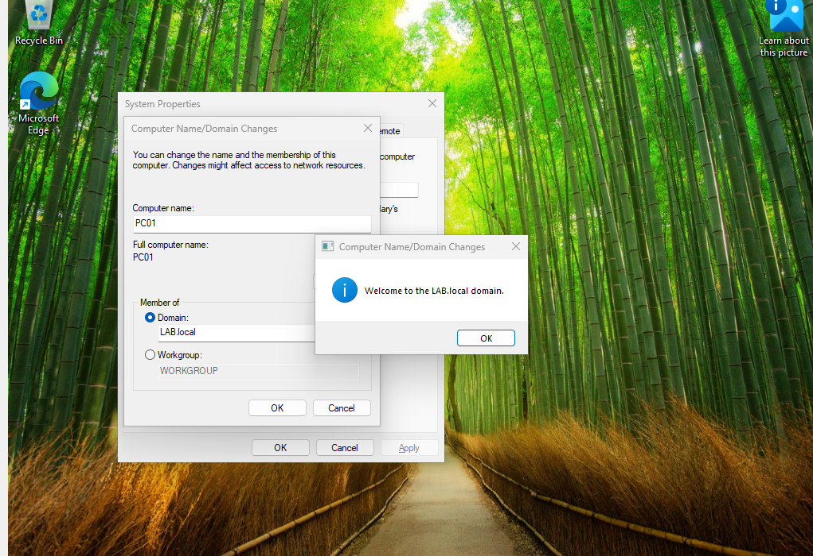
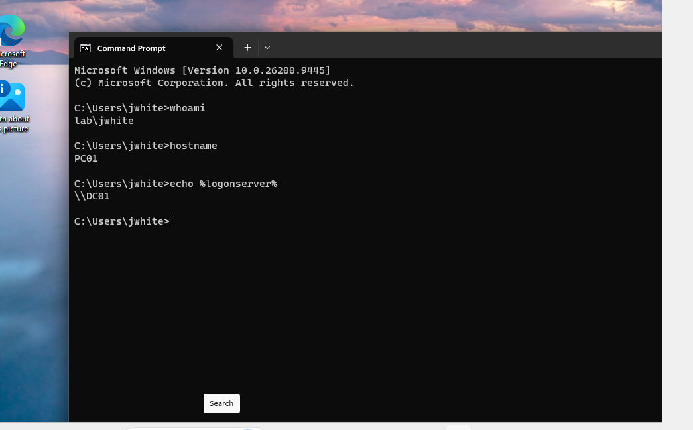
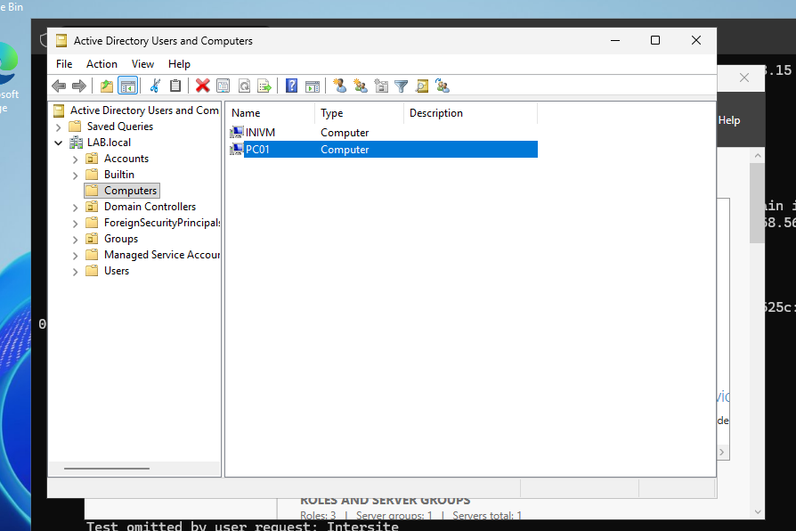
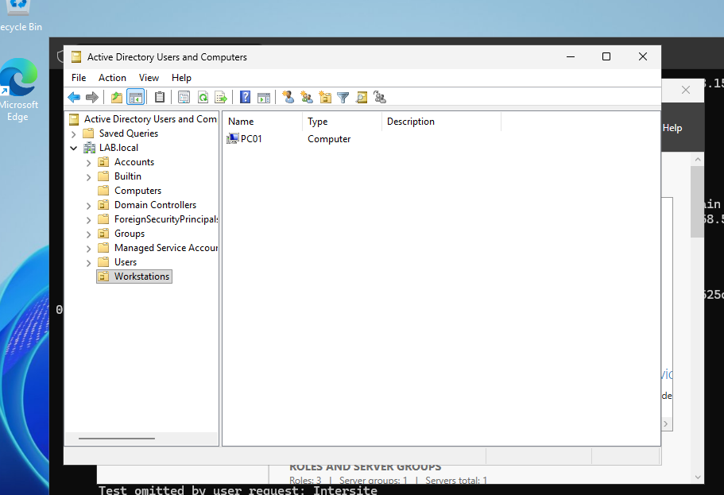

# Lab 04 — Active Directory Environment

## Objective

Build a basic Active Directory environment using Windows Server and Windows 11 Pro. This lab demonstrates domain configuration, Active Directory users and groups, DNS configuration, domain joining, domain authentication, and Organizational Unit management.

## Lab Environment

### Domain Controller
- Computer Name: DC01
- Operating System: Windows Server 2025
- Domain: LAB.local
- Role: Active Directory Domain Services and DNS
- Host-Only IPv4 Address: 192.168.56.12

### Client Workstation
- Computer Name: PC01
- Operating System: Windows 11 Pro
- Domain: LAB.local
- Host-Only IPv4 Address: 192.168.56.103

## Active Directory Structure

The LAB.local domain contains organizational units and security groups used to simulate a basic company environment.

### Accounts OU
- James White — jwhite
- Patty Lens

### Groups OU
- Finance
- HR

### Workstations OU
- PC01

## Finance Group Membership

James White was added to the Finance security group.

Using group-based access allows administrators to assign access to a group instead of assigning permissions individually to every employee.

This makes access easier to manage and supports the principle of least privilege.



## PC01 Network and DNS Configuration

PC01 was configured with two VirtualBox network adapters:

- NAT for external network connectivity
- Host-Only Adapter for communication with the domain controller

PC01 successfully communicated with DC01 at:

`192.168.56.12`

The DNS configuration on PC01 was changed to use DC01 as its DNS server.

DNS Server:

`192.168.56.12`

This allows PC01 to locate the LAB.local domain and discover Active Directory services.

The following commands were used during testing:

```cmd
ipconfig
ping 192.168.56.12
ipconfig /flushdns
nslookup LAB.local
nltest /dsgetdc:LAB.local
```

## Domain Join

After verifying network connectivity and DNS resolution, PC01 was joined to the LAB.local Active Directory domain.

Windows confirmed the domain join with:

`Welcome to the LAB.local domain.`



## Domain User Authentication

After restarting PC01, the workstation was accessed using the LAB.local domain account for James White.

The following commands were used to verify the login:

```cmd
whoami
hostname
echo %logonserver%
```

Results confirmed:

- User: LAB\jwhite
- Workstation: PC01
- Logon Server: \\DC01

This verified that James White was logged into PC01 using a domain account and that DC01 handled the domain authentication.



## Active Directory Computer Object

After PC01 joined LAB.local, a computer object for PC01 appeared in Active Directory Users and Computers.

This confirmed that the workstation was registered as a computer within the domain.



## Workstations Organizational Unit

A new Organizational Unit named `Workstations` was created.

PC01 was moved from the default Computers container into the Workstations OU.

Organizational Units allow administrators to organize Active Directory objects and can later be used to target administrative settings such as Group Policy.



## Troubleshooting Encountered

### Windows Edition

The original Windows 11 virtual machine used in earlier labs was running Windows 11 Home.

Windows 11 Home cannot join a traditional on-premises Active Directory domain.

A new Windows 11 Pro virtual machine was created because Windows 11 Pro supports Active Directory domain joining.

### DNS Resolution

PC01 could initially communicate with DC01 by IP address, but DNS queries were still being sent to the router DNS server.

The client DNS configuration was changed to use DC01 at `192.168.56.12`.

After flushing the DNS cache, PC01 successfully resolved LAB.local and located DC01 as a domain controller.

This demonstrated that basic IP connectivity alone is not enough for Active Directory. Correct DNS configuration is essential for domain discovery and authentication.

## Key Takeaways

- Active Directory provides centralized identity and computer management.
- Domain accounts are different from local Windows accounts.
- DNS is critical for Active Directory domain discovery.
- Domain-joined computers receive computer objects in Active Directory.
- Security groups can be used to manage access based on job requirements.
- Organizational Units organize Active Directory objects and can be used for administrative management and Group Policy.
- Group membership and OU placement serve different purposes.
- Windows 11 Pro supports traditional Active Directory domain joining while Windows 11 Home does not.
- Troubleshooting should verify network connectivity, DNS, domain discovery, and authentication separately.

## Help Desk Relevance

This lab demonstrates several skills commonly used in enterprise Help Desk environments:

- Working with Active Directory Users and Computers
- Managing Active Directory users and security groups
- Understanding local accounts versus domain accounts
- Configuring client DNS for Active Directory
- Joining Windows workstations to a domain
- Verifying domain authentication
- Managing computer objects
- Organizing computers using Organizational Units
- Troubleshooting domain connectivity and DNS issues

## Lab Status

**Completed**
